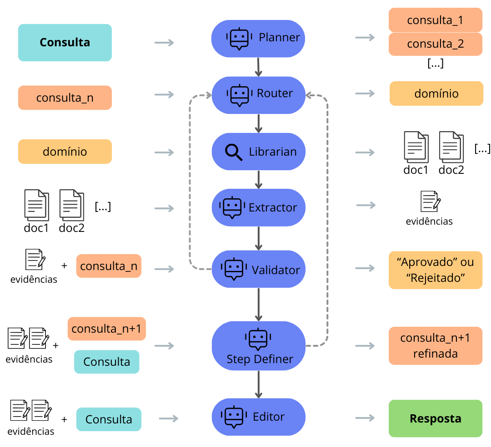

O <kbd>InfoDev</kbd> é um sistema de busca e recuperação de informações projetado para ambientes de desenvolvimento de software.  Utilizando uma arquitetura de <abbr title="Retrieval-Augmented Generation">RAG</abbr> multiagente, o sistema é capaz de navegar por fontes de informações heterogêneas para fornecer respostas precisas sobre o projeto de software.

---

> Alguma vez você já olhou para o código e estranhou uma lógica que nunca viu antes? O <kbd>InfoDev</kbd> te ajuda! Ele relaciona aquela lógica com alguma task que a descreveu (ou até mesmo algum e-mail ou mensagem se for algo mais informal!) e retorna todas as informações pra você, promovendo rastreamento e relacionamento de informações!

### Stack Tecnológica

- <kbd>Orquestração</kbd>: Construído com <abbr title="Framework para criação de fluxos cíclicos de agentes">LangGraph</abbr> e <abbr title="Framework de integração para LLMs">LangChain</abbr>, permitindo a coordenação de múltiplos agentes especializados;

- <kbd>Modelos de Linguagem</kbd>: Integração com LLMs de última geração e modelos de <abbr title="Modelos para representação vetorial de texto">Embeddings</abbr> validados pelo benchmark MTEB;

- <kbd>Vector Database</kbd>: Armazenamento e busca por similaridade em documentos técnicos, commits e discussões de código;

- <kbd>Processamento de Dados</kbd>: Pipelines para ingestão e extração de conhecimento do dataset <abbr title="Conjunto de dados focado em engenharia de software">SmartSHARK</abbr>;

---

### Diferenciais

- <kbd>Arquitetura Multiagente</kbd>: Separação de tarefas entre agentes de busca, análise de texto e código, e síntese de respostas, aumentando a confiabilidade dos dados recuperados;

- <kbd>RAG Avançado</kbd>: Implementação de técnicas de recuperação que vão além da busca semântica simples, focando no contexto histórico de repositórios;

---

### Arquitetura do Sistema

O fluxo de trabalho utiliza grafos de estado para gerenciar o raciocínio dos agentes, permitindo loops de feedback onde um agente revisor pode solicitar uma nova busca caso a informação inicial seja insuficiente.

